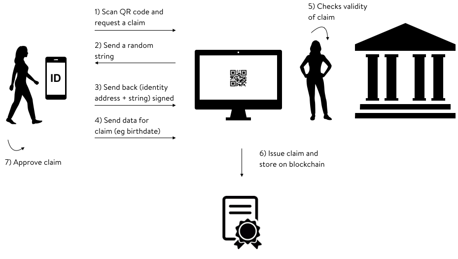
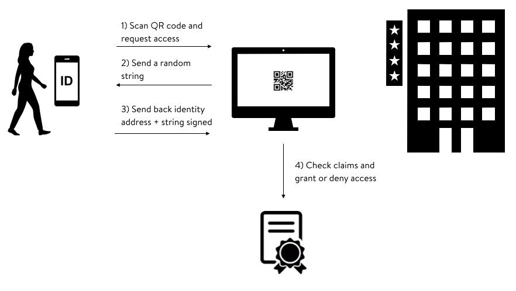

# Self-sovereign Digital Identity

## Abstract

The purpose of VALID is to provide a public utility for self-sovereign identity
with additional features for personal data management. In this paper we are
going to describe our proposed approach to create a self-sovereign digital
identity solution on the Ethereum blockchain based on the ERC725 standard.


## Identity on the Blockchain

There are many problems that can be solved by blockchain in the context of
digital identity, the biggest of all is the fragmentation and the ownership of
the data. A blockchain solution could give back control of the identity and
improve security and user experience. Projects like
[uPort](https://www.uport.me/), [Civic](https://www.civic.com/) and
[Sovrin](https://sovrin.org/) are trying to address this problem; they all
adopt the same principle of "claim". A claim is an assertion of a certain
attribute about an identity given by another identity. An identity is then
ultimately a collection of keys and claims. The ERC725 standard proposal by
Fabian Vogelsteller would utilize this concept and defines an interoperable
interface for it. Like in the case of ERC20, which enabled the interoperability
of tokens projects, this standard should foster the identity ecosystem.

### ERC725: Identity

[ERC725](https://github.com/ethereum/EIPs/issues/725) describes an interface
for an unique identity for humans, groups, objects and machines.

An identity has a collection of keys associated to it, which are used to
authenticate interactions with third parties or to authorize changes to the
identity itself. The identity can also hold a set of claims, which are further
described in ERC735. In this context key refers to a public key of an Ethereum
account (externally owned account) or a contract address.

The proposal is still in a very early stage, so the details concerning the
interface are likely to change.

Currently the key management functions are the following:

```javascript
  getKeyType
  getKeysByType
  addKey
  removeKey
  replaceKey
```

The functions to act with identity are two:

```javascript
  execute
  approve
```

The first to trigger functions on other contracts or itself, the second to approve an execution or a claim addition.

Lastly 2 functions to manage the claims;

```javascript
  addClaim
  removeClaim
```

Added claims must me approved and the issuer of a claim can always revoke it.

### ERC735: Claim Holder

The [ERC735](https://github.com/ethereum/EIPs/issues/735) standard proposal
describes a standard format, as well as a management interface for adding,
removing and holding claims. Claims are stored on the blockchain as part of the
identity contract.

The claim structure is the following:

```javascript
struct Claim {
  uint256 claimType;
  address issuer;
  uint256 signatureType;
  bytes signature; // signed hash of this.address + claimType + data
  bytes data;
  string uri;
}
```

With the following functions:

```javascript
  getClaim
  getClaimByIDsByType
  addClaim
  removeClaim
```

#### Claim Privacy

To protect the privacy of the identity the underlying data of a claim (e.g. the
name of a person, its birthdate, etc.) is not directly stored in the claim.
Instead it only stores a hash of the data, which is then signed by the claim
issuer (together with the other claim metadata). This signature is then also
stored in the claim. This protects the underlying data, but enables anyone to
check the integrity of the private data (if made available by the identity
owner).


## Use Cases

Let's say Alice wants her birthday to be verified by the local authority in her
town, she would go to the authority office and scan a QR code to start the
process. The authority sends a random string to Alice that she needs to send
back with her identity address, all signed with one of her private keys. Now
the authority is certain that the identity is owned by Alice. She can now send
the data for her claim (her birthdate). The authority will match the date with
the one on Alice's passport and verify the trueness of the statement. If
everything is correct the authority will issue a claim and publish it in the
blockchain. The claim will contain the signed (by authority) hash of the data,
such that the data is stored uniquely on Alice's device but the integrity of
the data can be verified. The last step needed in order to finalize the process
is Alice approval to publish the claim on her identity.



Let's say that now Alice whats to enter a casino and prove her age at the
entrance. She would initiate the process by scanning a QR code. The same random
string challenge will be repeated to validate the ownership of the identity.
Alice also sends her birthday. After that the casino system will check the
existence of the claim and its validity by comparing the hash of the birthday
data claimed by alice and the one stored on the blockchain signed by the
authority. The casino must know what identity are reputable issuer of claims.
If the claim is verified she can now enter the casino.



Of course this would not be a safe implementation of the protocol, as Alice
could borrow the identity from a friend of hers. This impersonation can be
avoided by including biometric claims about Alice. For example a photo of Alice
could be saved and verified by an authority. The casino could request access to
the data underlying the biometric claim and check the facial match with a face
recognition algorithm and grant the access or not.


## Implementation


## VALID Personal Data Use Case


## Escrow Contract VALID


## Privacy

considerations
zkSNARKs

